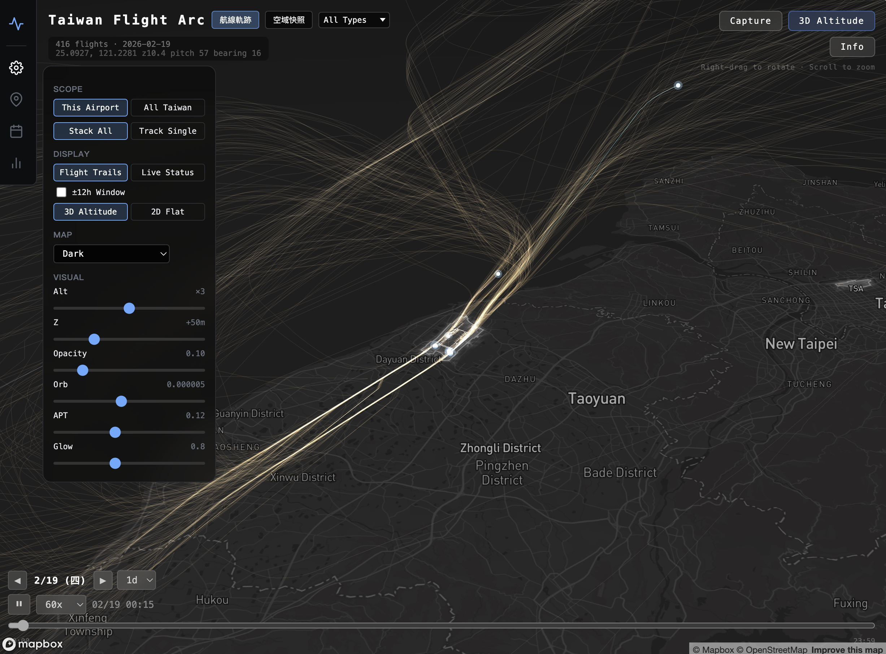
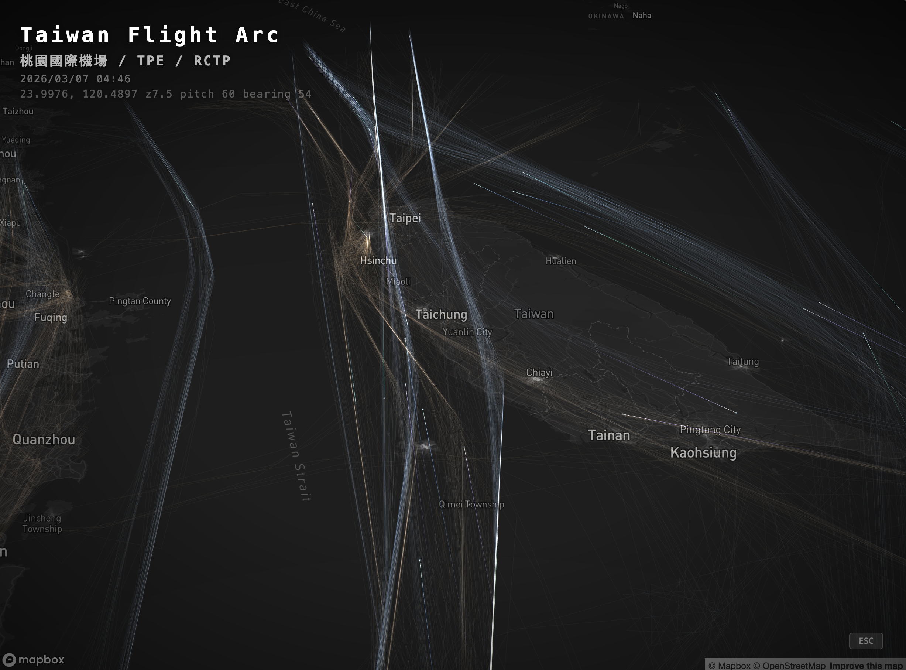
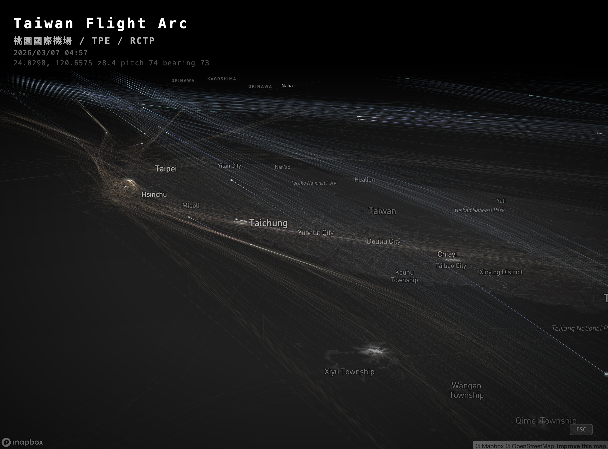
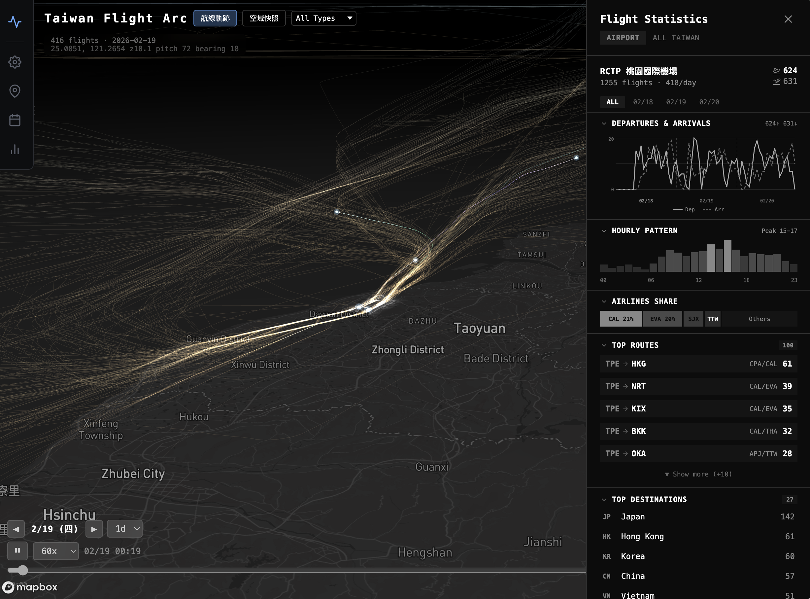
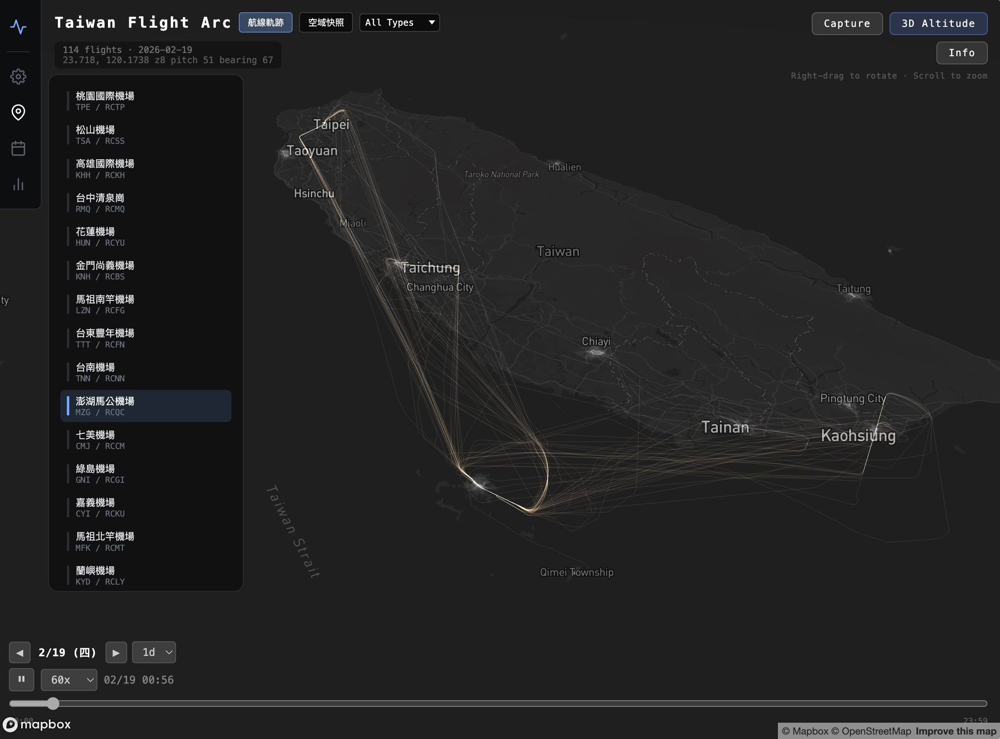

# Flight Arc

航班軌跡生成式藝術（Generative Art）視覺化。涵蓋東亞及世界特色機場，將航班起降軌跡轉化為光軌藝術作品。

## Screenshots







## 涵蓋範圍

138 座機場 camera presets，1,594 個 JSONL 資料檔，**51,541 筆不重複軌跡航班**（dep + arr 雙向）。

| 區域 | 機場數 | 說明 |
|------|--------|------|
| Taiwan (TW) | 16 | 民用 + 軍民合用機場 |
| Japan (JP) | 70 | 七大主要 + 地方 + 沖繩離島（含奄美、鹿兒島離島），分層級顯示 |
| Korea (KR) | 6 + Overview | RKSI 仁川、RKSS 金浦、RKPK 釜山、RKPC 濟州、RKTU 清州、RKTN 大邱 |
| Thailand (TH) | 9 + Overview | VTBS 蘇凡那布、VTBD 廊曼、VTCC 清邁、VTSP 普吉、VTSG 喀比、VTSM 蘇梅、VTBU 烏塔堡、VTSS 合艾、VTSB 素叻他尼 |
| China (CN) | 上海/北京為主 | ZSPD 浦東、ZSSS 虹橋、ZBAA 首都、ZBAD 大興（ICAO Z 開頭，排除北韓/蒙古）|
| Hong Kong (HK) | 1 | VHHH 香港國際機場 |
| Singapore (SG) | 1 | WSSS 樟宜國際機場 |
| United States (US) | 17 | 亞特蘭大 / 紐約三場 / LA 都會 / SF 灣區 / 西雅圖 等樞紐 |
| United Kingdom (UK) | 11 | 倫敦群 10 座（EGLL/EGKK/EGSS/EGGW/EGLC/EGTK/EGKB/EGLF/EGMC/EGMD）+ 其他 |
| Middle East (ME) | 3 | OMDB 杜拜、OMAA 阿布達比、OMSJ 沙迦（戰前/戰當天/戰後 3 個日期） |
| Europe Hubs | 9 | LFPG 巴黎 CDG / LFPO 奧利 / LFPB 布爾歇 / LFOB 博韋、EHAM 阿姆斯特丹、EDDF 法蘭克福、EDDM 慕尼黑、LEMD 馬德里、LTFM 伊斯坦堡 |
| World | 2+ | Madeira (LPMA)、Paro (VQPR) 等特色機場 |

Region Pills UI 可切換 TW / JP / HK / **KR / TH** / **CN** / US / UK / World / All，每個區域有對應的場景預設與攝影機視角。

### 軌跡資料量（Track Coverage）

> **最後更新：2026-08-09** ｜ 數據來源：`public/tracks/manifest.json`（每次跑 `split-tracks.ts` 後更新）
> ⚠️ **抓完新軌跡後務必同步更新此表**（見下方維護說明）。

- **不重複軌跡航班**：65,429 筆（`scripts/track-done.ndjson`）
- **機場 JSONL 檔**：1,829 座
- **主動查詢機場**：204 座（165 core + Top-1000 戰役 Batch 1 的 39 座 megahub）
- **🌀 巴威颱風資料集**（2026-07-25 新增）：台灣 22 座機場 7/9–7/12 全時段起降軌跡 3,103 筆（7/11 桃機 760 架次全取消、出入境 0 人的「空白日」與前後疏散/回歸潮）
- **進行中**：[Top-1000 全球網戰役](docs/backlog/data-fetching-status.md) — 2/18 全球前 1000 大機場軌跡，已 **27.4%**（8/09 抓 10,785 筆／432K credits；Batch 1 剩 3,057。⚠️ 亞洲 megahub 因字母序排在尾端幾乎沒抓到，下輪優先）

| Region | 軌跡數（含雙向） | 大小 (gzip) |
|--------|------:|------:|
| other（未分區）| 28,548 | 9.61 MB |
| US 美國 | 22,314 | 6.57 MB |
| TW 台灣 | 12,215 | 3.78 MB |
| CN 中國 | 7,609 | 1.89 MB |
| JP 日本 | 5,600 | 1.66 MB |
| UK 英國 | 3,899 | 1.20 MB |
| KR 韓國 | 2,820 | 0.82 MB |
| TH 泰國 | 2,691 | 0.87 MB |
| HK 香港 | 1,838 | 0.60 MB |

**軌跡數 Top 15 機場**（★ = 主動查詢）：

| 機場 | 軌跡 | 機場 | 軌跡 | 機場 | 軌跡 |
|------|---:|------|---:|------|---:|
| ★RCTP 桃園 | 7,680 | ★VHHH 香港 | 1,838 | KDFW 達拉斯 | 1,517 |
| ★OMDB 杜拜 | 2,860 | ★KLAX 洛杉磯 | 1,831 | ★KSFO 舊金山 | 1,516 |
| ★WSSS 新加坡 | 2,039 | ★RCKH 高雄 | 1,805 | KDEN 丹佛 | 1,504 |
| KORD 芝加哥 | 1,996 | ★ZSPD 浦東 | 1,719 | ★RKSI 仁川 | 1,500 |
| ★KATL 亞特蘭大 | 1,865 | ★RCSS 松山 | 1,526 | ★VTBS 曼谷 | 1,414 |

> 軌跡資料**不進 git**，存於 S3（`migu-gis-data-collector/flight-arc/`），部署時由 Zeabur 端 `pull-from-s3.sh` 拉取。完整抓取進度與下一步規劃見 [`docs/backlog/data-fetching-status.md`](docs/backlog/data-fetching-status.md)。

#### 🔄 維護此表（重要）

每次用 `fetch-tracks.ts` 抓完新軌跡、跑完 `split-tracks.ts` 後，**務必同步更新上方「軌跡資料量」表**（region 數字、總筆數、Top 15、最後更新日）。數字一律以重建後的 `public/tracks/manifest.json` 為準。

## 視覺概念

- **光軌**：航班軌跡以彗尾狀漸層光軌呈現，additive blending 疊加自然增亮
- **光球**：每架飛機以多層發光球體標示當前位置，搭配呼吸動畫
- **閃爍燈**：紅色雙閃警示燈，模擬真實防撞燈號
- **靜態軌跡**：全部航班路徑同時顯示，3D 模式依高度著色（暖橘→冷藍），2D 模式每航班隨機配色
- **機場邊界**：OSM 機場多邊形，暗色主題白色填充 + 光暈，亮色主題金黃色填充 + 光暈
- **主題適應**：所有 UI 元件（sidebar、tooltip、timeline、calendar）自動適應底圖明暗（Dark / Light）
- **拍攝模式**：一鍵隱藏 UI，暗角 vignette 效果，適合截圖輸出

## 功能

### 資料來源切換

| 模式 | 資料來源 | 說明 |
|------|---------|------|
| 航線軌跡 | FlightRadar24 API | FR24 精細軌跡（95+ 機場起降航線），10,700+ 航班 |
| 空域快照 | OpenSky Network / ADS-B | 台灣附近空域全覆蓋掃描，涵蓋過境、軍機等 |

### 區域選擇（Region Selector）

Region Pills 切換地理區域：TW / JP / HK / KR / TH / US / UK / World / All。切換時自動載入對應 region jsonl（依 ICAO prefix 分類）、更新機場選單與場景預設、跳至有資料的日期。日本機場依流量分為四層級：Major（10）/ Regional（15）/ Local / Special。

### 資料載入

Per-airport lazy loading 架構：每座機場獨立 JSONL 檔案（`tracks/airports/{ICAO}.jsonl`），NDJSON streaming 逐行解析 + progressive rendering，選擇機場或區域時才載入，大幅減少初始載入量。

區域總覽（All Region）模式下，依序載入各機場 JSONL 完整軌跡並去重，大機場優先載入。

### Deep Analysis 面板（🔬）

針對單一機場（或多機場組合）的深度分析工具，整合分類著色、多條件篩選、視覺化調整於一個面板。

#### Color By（分類著色）

5 種維度任選，動態軌跡 + 靜態軌跡 + 光球同步上色：

| 維度 | 分類 |
|------|------|
| Aircraft Size | widebody（雙通道）/ narrowbody / regional / prop / bizjet / heli / military / cargo |
| Airline | Top 10 operating_as 用品牌色（中華航空紅、長榮綠、星宇紫、Emirates 紅⋯）+ Others 灰 |
| Flight Purpose | commercial / lowcost / regional / cargo / bizjet / military / training / helicopter |
| Flight Duration | short(<1h) / medium(1-3h) / long(3-6h) / ultralong(6h+) — 綠→黃→橘→紅漸層 |
| Route Scope | domestic / regional / intercontinental |

Legend 即時顯示分類顏色 / 計數 / 百分比。

#### Multi-Condition Filter（多條件篩選）

可疊加 6 個維度，所有條件 AND 組合：

- **Aircraft Type**：折疊式 multi-checkbox，按頻率排序（含機型 sub label）
- **Airline**：multi-checkbox 用 `operating_as`（比 callsign 推導準 6.6%），顯示中文名為主、ICAO 為 sub
- **Purpose chips**：商業 / 低成本 / 區域 / 貨運 / 商務噴射 / 軍用 / 訓練 / 直升機
- **Route chips**：國內 / 區域 / 跨洲
- **Duration**：雙 thumb range slider 0-24h
- **Quick toggles**：Only Diverted（轉降）/ Only Wet Lease（濕租 / 代碼共享）

底部即時計數 `Showing X / Y flights`，一鍵 Reset all。

#### Visual（視覺化）

- **Scale points by aircraft size**：點位大小依機型分類自動縮放（widebody ×1.6 / narrowbody ×1.0 / bizjet ×0.55⋯）

#### 分類資料庫

- **Aircraft DB**：120+ 機型，含 category / wake turbulence (J/H/M/L) / 座位數 / 製造商
- **Airline DB**：151+ 航司，含中英文名 / 國家 / 品牌色 / 類型（fullservice/lowcost/cargo/regional⋯），涵蓋 88.6% 流量
- **Heuristic 啟發式**：軍機 hex range 偵測、轉降 / 濕租自動標記

### 檢視模式

設定面板將檢視控制拆為正交的三個維度，可自由組合：

**Scope（地理範圍）**

| 模式 | 說明 |
|------|------|
| This Airport | 選定機場相關航班 |
| Region | 當前區域所有航班 |

**Track Mode（軌跡模式）**

| 模式 | 說明 |
|------|------|
| Stack All | 顯示所有航班軌跡 |
| Track Single | 追蹤單一航班（相機鎖定） |

**±12h Window**

Flight Trails 模式下的子選項，開啟後僅顯示當前播放時間前後 12 小時內的航班。

### 渲染模式

| 模式 | 靜態軌跡 | 特色 |
|------|---------|------|
| 3D Altitude | Three.js LineSegments | 航線有高度，依海拔著色漸變 |
| 2D Flat | Mapbox 原生 line layer | 平面俯瞰，每航班獨立配色 |

### 即時參數調整

| 控制項 | 說明 |
|--------|------|
| Alt ×1.0~5.0 | 高度誇張倍率 |
| Z +0~200m | 基準高度偏移 |
| Opacity | 靜態軌跡不透明度 |
| Orb | 光球大小 |
| APT | 機場填充不透明度 |
| Glow | 機場光暈強度 |

### 日期導航（Calendar）

行事曆日期選擇器，標記 full / partial 資料完整度：

- 日期範圍（Range Days）：1d / 3d / 7d，可同時顯示多日資料
- 播放速度：30x ~ 600x 加速
- 進度條拖曳 seek
- 前/後日快速切換按鈕

### 場景預設（Scene Presets）

每個區域內建推薦場景，一鍵套用完整設定（資料來源、範圍、日期、時間、視角、透明度、機型篩選）：

| 場景 | 區域 | 資料來源 | 說明 |
|------|------|---------|------|
| 台灣空中走廊 | TW | 空域快照 | 凌晨空中走廊全景 |
| 活躍中國境內班機 | TW | 空域快照 | 中國沿海航線 |
| 桃園機場起降 | TW | 航線軌跡 | RCTP 近距起降 |
| 全台航線總覽 | TW | 航線軌跡 | 全台航班鳥瞰 |
| P-8 反潛機巡邏路徑 | TW | 空域快照 | 軍機篩選 + 高透明度 |
| 小牧基地 C-130 | JP | 航線軌跡 | 名古屋飛行場軍用運輸機 |
| 東京觀光直升機 | JP | 航線軌跡 | 羽田附近觀光直升機路線 |

### Icon Rail Sidebar（桌面版）

左側圖示列 + 浮動面板系統：

| 面板 | 功能 |
|------|------|
| 設定 | 顯示模式、渲染模式、底圖樣式、視覺參數滑桿 |
| 📍 位置 | 區域選擇 + 場景預設 + 機場快速跳轉 |
| 🔗 多機場組合 | 5 組預設 set（EU+LHR 紐帶、TW 國際、亞太樞紐、跨大西洋、倫敦群），與單一機場互斥 |
| 行事曆 | 日期選擇器（full/partial 標記） |
| 配色 | 6 種主題切換、各元素 color picker 微調、Compare Airports 機場分色 |
| 空域 | 限制空域顯示開關、5 類分類選擇、opacity / 高度倍率 / 邊緣發光調整 |
| Summary | 即時統計、航空公司篩選、Dep/Arr toggle、24h 熱力條、每日趨勢 |
| 🔬 Deep Analysis | 5 種 Color By 維度 + 6 種 multi-filter + 點位大小依機型縮放（詳見上方）|
| 統計 | 開啟 Flight Statistics 完整面板 |
| 資訊 | 開啟 Info Modal |

### 限制空域 Airspace Overlay

3D 半透明極光風格的飛航管制空域視覺化（Three.js 自訂 shader）：

| 分類 | 來源 | 顏色 | 說明 |
|------|------|------|------|
| Restricted (RCR) | 限航區 | 暖紅 | 軍事或敏感區域，需先申請 |
| Prohibited / Danger | 禁航 + 危險 | 紫紅 | 完全禁止 / 危險演習 |
| Training / ULZ | 訓練 + 超輕型 | 青綠 | 訓練空域、超輕型載具區 |
| TMA / Control | TMA + CTR | 冷藍 | 終端管制區、塔台管制 |
| FIR | 飛航情報區 | 淡白 | 大區域邊界 |

**資料來源**：
- 台灣：交通部民用航空局 eAIP（AIRAC 01-26）
- 英國：[OpenAIP](https://www.openaip.net/) REST API（CTR / TMA / Restricted / Danger / Prohibited）

**互動**：點擊空域多邊形 → 右下浮動卡片顯示名稱、ICAO class、底/頂高度、限制 remarks（含管理單位電話、申請程序、限航時段自動抽取等）、warnings、同點重疊空域列表（可切換）。

**渲染特色**：
- Per-vertex aurora gradient（底部實 → 頂部稀釋成極光青藍紫）
- 頂邊 LineSegments + AdditiveBlending 發光描邊
- 世界座標 hash 驅動 shimmer 動畫
- Dark / Light 主題自適應（亮色降飽和度避免刺眼）

### 機場分色比較（Compare Airports）

Colors 面板內建 opt-in toggle，啟用後依機場為每條航班指派獨立色票，方便比較多機場流量分佈：

| 維度 | 說明 |
|------|------|
| Local | 自動挑出該航班兩端中屬於當前 region 的機場（推薦）|
| Origin | 起飛機場分色 |
| Destination | 目的地機場分色 |

- 10 組視覺上可分辨的色票（Amber / Cyan / Magenta / Lime / Violet / Coral / Teal / Gold / Sky / Rose）
- 依機場航班數由多到少自動指派 palette
- 每個機場可手動點色票自訂
- 同時影響 3D 動態光軌、3D 靜態網格、2D Mapbox 軌跡線
- 與日期 Compare 互斥（日期 Compare 啟用時自動禁用）

### Loading Screen

動畫載入畫面：

- 30 秒毫秒級倒數計時（requestAnimationFrame）
- SVG 飛機沿弧線飛行動畫（含尾跡粒子、防撞燈閃爍）
- 隨機輪播使用技巧（Tips），每 4 秒切換

### Info Modal（使用指南）

多頁式資訊面板，支援中英切換：

| 頁面 | 內容 |
|------|------|
| 操作指南 | 地圖操作、點擊互動、工具列說明 |
| 功能圖例 | 視覺元素、參數控制、機場標記 |
| 資料來源 | 四大資料源詳細說明 |
| 使用技巧 | 所有 Tips 分類展示 |
| 關於專案 | 技術堆疊、架構亮點 |
| 個人介紹 | 社群連結、其他專案 |

### Flight Statistics 側邊面板

右側可拖拉寬度（280~720px）的統計分析面板，JetBrains Mono 字型 + glass-morphism 風格：

| 區塊 | 說明 |
|------|------|
| Date Selector | 多選日期篩選，所有統計即時更新 |
| Departures & Arrivals | SVG 折線圖，實線=起飛、虛線=降落 |
| Hourly Pattern | 垂直長條圖，24 小時分佈 |
| Airlines Share | 堆疊水平長條，前 4 大航空公司市佔比例 |
| Top Routes | 卡片式航線清單，支援三段展開 + drill-down |
| Top Destinations | 按國家分組的目的地統計，可 drill-down |
| Aircraft Types | 機型水平長條，三段展開 |
| Fleet Mix | Narrowbody / Widebody / Regional 分類統計 |
| Flight Duration | 短程 / 區域 / 中程 / 長程分佈 |
| Region Tab | 區域內機場比較、可達目的地（按國家）、區域航線統計 |

### 其他

- 6 種 Mapbox 底圖樣式（Dark / Light / Satellite / Navigation Night 等）
- 95+ 座機場預設視角，選單顯示名稱與 IATA 代碼
- Capture 拍攝模式（暗角 vignette + 機場名稱 + 時間標記）

### 手機版適配（Responsive）

768px 以下自動切換為手機版 layout，最大化地圖可視區域：

- **Compact Header**（44px）：機場選擇 + Info / Capture / 3D 切換
- **Timeline Bar**：固定在 header 下方，Play 按鈕 44×44 觸控友善
- **Bottom Sheet**：三段展開（收合 → 半開含 FlightPicker → 全開含 Sliders + StyleSelector）
- **Safe Area**：適配 iPhone Home Indicator（`env(safe-area-inset-bottom)`）

## 技術棧

| 層級 | 技術 | 用途 |
|------|------|------|
| 框架 | React 19 + TypeScript + Vite 6 | 應用骨架 |
| 地圖 | Mapbox GL JS v3 | 3D terrain、底圖、相機控制 |
| 3D 渲染 | Three.js r172 | 光軌、光球、閃爍燈、靜態軌跡、批量渲染 |
| Shader | GLSL | 光軌漸層材質、批量軌跡材質 |
| 資料串流 | NDJSON Streaming | Per-airport lazy loading + progressive rendering |
| 資料 | FlightRadar24 API + OpenSky Network | 航線軌跡 + 空域掃描 |
| 地理 | OpenStreetMap / Overpass API | 機場邊界多邊形 |
| 雲端 | AWS S3 | 航班資料儲存與增量更新 |
| 部署 | Docker + Nginx + Zeabur | 容器化部署 |

## 架構

### Three.js + Mapbox 整合

透過 Mapbox `CustomLayer` 在同一個 WebGL context 中嵌入 Three.js 場景。Mapbox 負責地圖 + 相機，Three.js 負責光軌渲染，座標透過 `MercatorCoordinate` 同步。

```
Mapbox GL JS（底圖 + 3D terrain + 相機控制）
  └── CustomLayer（renderingMode: '3d'）
        └── Three.js Scene
              ├── Static Trails（LineSegments, per-vertex altitude color）
              ├── BatchedTrails（批量渲染，GLSL instancing）
              ├── LightTrail（GLSL gradient shader trail）
              ├── InstancedOrbs（Instanced IcosahedronGeometry）
              ├── LightOrb（多層球體 + AdditiveBlending）
              └── BlinkingLight（red flash mesh）
```

### 資料架構

```
public/tracks/
├── airports/                    # Per-airport JSONL（275 檔）
│   ├── RCTP.jsonl              # 每座機場獨立檔案
│   ├── RJTT.jsonl
│   └── ...
├── regions/                     # 區域總覽
│   ├── TW.jsonl
│   ├── JP.jsonl
│   ├── HK.jsonl
│   └── other.jsonl
├── manifest.json                # 日期/機場/航班數 metadata
└── aviation_data.json           # 完整合併資料（gitignored）

public/airspace/
├── days/                        # 每日空域快照（gitignored，走 S3 pull）
│   └── YYYY-MM-DD.jsonl
├── taiwan_airspace.geojson      # 台灣限制空域（CAA eAIP，承諾入版）
├── gb_airspace.geojson          # 英國限制空域（OpenAIP，承諾入版）
└── aviation_data.json

public/airports.geojson          # OSM 機場邊界多邊形
```

### 資料流

```
1. npm run fetch:flights         → 抓航班清單（FR24 API）
2. npm run fetch:tracks          → 抓飛行軌跡（支援 --airports 篩選）
3. scripts/split-tracks.ts       → 拆分為 per-airport JSONL
4. npm run fuse:data             → 合併多源資料（空域快照）
5. npm run s3:upload             → 上傳到 S3 flight-arc/
```

### 專案結構

```
Flight Arc/
├── public/
│   ├── tracks/                        # 航線軌跡資料（gitignored）
│   │   ├── airports/{ICAO}.jsonl      # Per-airport JSONL（275 檔）
│   │   ├── regions/{region}.jsonl     # 區域總覽
│   │   └── manifest.json
│   ├── airspace/                      # 空域快照資料（gitignored）
│   │   └── days/YYYY-MM-DD.jsonl
│   ├── airports.geojson               # OSM 機場邊界多邊形
│   └── screenshots/
├── scripts/
│   ├── fetch-flights.ts               # 航班清單擷取（FR24 API）
│   ├── fetch-tracks.ts                # 飛行軌跡擷取（--airports filter，含完整 metadata）
│   ├── split-tracks.ts                # 拆分為 per-airport JSONL
│   ├── fetch-airport-boundaries.ts    # OSM 機場邊界下載
│   ├── upload-split-to-s3.ts          # S3 上傳（per-airport JSONL + manifest）
│   ├── fuse-collector-data.ts         # 合併多源資料
│   └── oneoff/                        # 一次性/歷史腳本（backfill-metadata、backup-to-s3 等）
├── src/
│   ├── App.tsx                        # 主應用 + 狀態管理
│   ├── types/index.ts                 # 型別定義（Region, Scope 等）
│   ├── data/
│   │   ├── flightLoader.ts            # JSONL 串流載入、篩選、前處理
│   │   ├── flightStats.ts             # 統計計算引擎
│   │   ├── s3Loader.ts               # S3 增量更新
│   │   ├── aircraftCategories.ts      # 舊機型分類（ScenePreset 相容用）
│   │   ├── aircraftDatabase.ts        # 120+ 機型資料庫（category/wake/seats）
│   │   ├── airlineDatabase.ts         # 151+ 航司資料庫（中英文名/品牌色/類型）
│   │   ├── classify.ts                # 統一分類 API（duration/route/purpose/filter）
│   │   ├── analysisColors.ts          # Deep Analysis 調色盤 + perFlightColorMap
│   │   └── tips.ts                    # 使用技巧
│   ├── map/
│   │   ├── MapView.tsx                # Mapbox 容器 + 機場圖層
│   │   ├── customLayer.ts             # CustomLayer ↔ Three.js 橋接
│   │   ├── staticTrails.ts            # 2D Mapbox 原生軌跡圖層
│   │   └── cameraPresets.ts           # 95+ 機場視角預設 + 區域分組
│   ├── three/
│   │   ├── FlightScene.ts             # 場景管理器
│   │   ├── LightOrb.ts               # 多層球體光球
│   │   ├── LightTrail.ts             # GLSL 光軌渲染
│   │   ├── BlinkingLight.ts           # 紅色閃爍燈
│   │   ├── BatchedTrails.ts           # 批量軌跡渲染
│   │   ├── InstancedOrbs.ts           # 實例化球體渲染
│   │   └── shaders/                   # GLSL vertex/fragment shaders
│   ├── hooks/
│   │   ├── useFlightData.ts           # 資料載入 hook（JSONL streaming）
│   │   ├── useTimeline.ts             # 日期導航 + 時間軸播放
│   │   └── useIsMobile.ts             # 響應式斷點偵測
│   ├── components/
│   │   ├── IconRailSidebar.tsx        # 左側圖示列 + 區域選擇 + 場景預設 + 多機場組合
│   │   ├── DeepAnalysisPanel.tsx      # 🔬 Color By + multi-filter + 視覺化 toggle
│   │   ├── LoadingScreen.tsx          # 動畫載入畫面
│   │   ├── InfoModal.tsx              # 多頁式使用指南
│   │   ├── FlightStatsPanel.tsx       # 右側統計面板（吃 filtered/all 雙 props）
│   │   ├── DataSourceToggle.tsx       # 航線軌跡 / 空域快照 切換
│   │   ├── DepArrToggle.tsx           # Dep / Arr / All 篩選
│   │   ├── TimelineControls.tsx       # 時間軸控制
│   │   ├── FlightPicker.tsx           # Scope + TrackMode 選擇
│   │   ├── AirportSelector.tsx        # 機場下拉選單（按區域分組）
│   │   ├── StyleSelector.tsx          # 底圖樣式選擇
│   │   └── MobileBottomSheet.tsx      # 手機版三段式底部面板
│   ├── utils/
│   │   ├── coordinates.ts             # MercatorCoordinate 轉換
│   │   ├── interpolation.ts           # 軌跡時間插值
│   │   ├── dateUtils.ts               # 時區日期/時間轉換
│   │   └── flightIndex.ts             # 航班索引
│   └── workers/
│       └── coordTransform.worker.ts   # 座標轉換 Web Worker
├── Dockerfile
├── docker-compose.yml
├── nginx.conf
├── .env.example
├── package.json
├── vite.config.ts
└── LICENSE
```

## 部署

### Docker

Multi-stage build：Node 22-alpine 編譯 → Nginx Alpine 服務。

```bash
docker compose up -d --build

# 或手動建置
docker build --build-arg VITE_MAPBOX_TOKEN=your_token -t flight-arc .
docker run -p 3721:8080 flight-arc
```

`VITE_MAPBOX_TOKEN` 必須在 build time 注入（Vite 會嵌入靜態檔）。

### Zeabur 部署

平台自動偵測 Dockerfile 並 build。額外設定：

- **環境變數**：`VITE_MAPBOX_TOKEN`（Build Variables）
- **/data Volume**：掛載持久化儲存，Nginx 會服務 `/data/` 路徑
- **S3 同步**：容器啟動後執行 `bash scripts/pull-from-s3.sh` 下載最新資料到 `/data`

## 航班資料（Flight API）

本專案使用 [FlightRadar24 API](https://fr24api.flightradar24.com/) 作為航班軌跡資料來源。

### 取得 API Token

1. 至 [FlightRadar24](https://fr24api.flightradar24.com/) 註冊帳號並訂閱方案（Essential 以上）
2. 進入 [Key Management](https://fr24api.flightradar24.com/key-management) 建立 API Token
3. 將 Token 寫入 `.env`：

```bash
cp .env.example .env
# 編輯 .env，填入 FR24_API_TOKEN
```

### 資料擷取腳本

```bash
# Step 1: 取得航班清單（可指定機場）
npm run fetch:flights

# Step 2: 逐一撈取飛行軌跡
npm run fetch:tracks -- --date 2026-02-18 --airports RCTP,RJTT

# Step 3: 拆分為 per-airport JSONL
npx tsx scripts/split-tracks.ts

# Step 4: 下載機場邊界多邊形
npx tsx scripts/fetch-airport-boundaries.ts

# Step 5: 上傳分拆資料到 S3
npx tsx scripts/upload-split-to-s3.ts

# Step 6: 備份原始資料到 S3
npx tsx scripts/oneoff/backup-to-s3.ts

# Zeabur: 從 S3 拉資料到 /data volume
bash scripts/pull-from-s3.sh
```

腳本支援**中斷續接**：如果因 rate limit 或網路中斷，重新執行即可自動接續。

### 資料格式

每座機場一個 JSONL 檔案（`tracks/airports/{ICAO}.jsonl`），每行一筆航班：

```json
{
  "fr24_id": "3e617f8a",
  "callsign": "CPA408",
  "flight_number": "CX408",
  "registration": "B-HLM",
  "aircraft_type": "A333",
  "operating_as": "CPA",
  "painted_as": "CPA",
  "hex": "78018D",
  "origin_icao": "VHHH",
  "dest_icao": "RCTP",
  "dest_icao_actual": "RCTP",
  "dep_time": 1771371753,
  "arr_time": 1771399200,
  "first_seen": 1771370128,
  "last_seen": 1771399583,
  "path": [[25.245, 55.371, 0, 1771371753], [25.300, 56.100, 10058, 1771373000]]
}
```

| 欄位 | 說明 |
|------|------|
| `path` | 軌跡點：`[緯度, 經度, 高度(m), Unix timestamp]` |
| `callsign` | ATC 用呼號（如 CPA408） |
| `flight_number` | IATA 航班號（如 CX408） |
| `operating_as` | 實際營運航空公司 ICAO 三字碼（精準，比 callsign 推導準 6.6%） |
| `painted_as` | 機身塗裝航空公司（與 operating_as 不同 = 濕租 / Codeshare，~11% 比例）|
| `hex` | ADS-B 晶片碼（全球唯一個體 ID，可用於軍機偵測 / 跨資料追蹤）|
| `dest_icao` / `dest_icao_actual` | 計畫降落 / 實際降落（不同 = 轉降，~0.5% 比例）|
| `first_seen` / `last_seen` | ADS-B 首次/最後偵測時間，與 dep_time/arr_time 可能差數分鐘 |

### 資料前處理

載入時 `flightLoader.ts` 會自動執行：

| 處理 | 說明 |
|------|------|
| ICAO→IATA 對照 | 補齊 FR24 未提供的 IATA 代碼 |
| 時間戳修復 | `dep_time` / `arr_time` 為 0 時，從 path 首尾點推算 |
| 英呎/公尺修正 | FR24 低高度單位切換自動偵測並轉換 |
| 換日線經度展開 | 跨越 ±180° 換日線的航班經度連續化 |

## 開發

### 1. 安裝相依套件

```bash
npm install
```

### 2. 設定環境變數

```bash
cp .env.example .env
```

| 變數 | 用途 |
|------|------|
| `VITE_MAPBOX_TOKEN` | Mapbox GL JS Access Token（[取得](https://account.mapbox.com/access-tokens/)） |
| `FR24_API_TOKEN` | FlightRadar24 API Token（[取得](https://fr24api.flightradar24.com/key-management)） |

### 3. npm Scripts

| 指令 | 說明 |
|------|------|
| `npm run dev` | Vite 開發伺服器 |
| `npm run build` | TypeScript 編譯 + Vite 建置 |
| `npm run preview` | 預覽 build 結果 |
| `npm run fetch:flights` | 抓航班清單（FR24 API） |
| `npm run fetch:tracks` | 抓飛行軌跡（`--date` / `--airports`） |
| `npm run fuse:data` | 合併多源資料（空域快照） |
| `npm run s3:upload` | 上傳資料到 S3（按日期分檔） |
| `npx tsx scripts/split-tracks.ts` | 拆分為 per-airport JSONL + regions |
| `npx tsx scripts/upload-split-to-s3.ts` | 上傳分拆資料到 S3 |
| `npx tsx scripts/fetch-airport-boundaries.ts` | 下載 OSM 機場邊界 |

### 4. 啟動

```bash
npm run dev     # 開發模式
npm run build   # 正式建置
```

## 調色盤預覽

專案包含獨立的色彩方案預覽頁面 `color-preview.html`，提供 8 種光軌配色方案，使用 Additive Blending 模擬實際光軌疊加效果。

```bash
open color-preview.html
```

## 專案沿革

| 時期 | 里程碑 | 說明 |
|------|--------|------|
| 2026/02 初 | **Taiwan Flight Arc** 誕生 | 以台灣 22 座機場為核心，FR24 API 抓取航班軌跡，Three.js + Mapbox 3D 弧線視覺化 |
| 2026/02 中 | 空域快照 + 統計面板 | 整合 OpenSky ADS-B 空域掃描、Flight Statistics 側邊面板（drill-down 分析） |
| 2026/02 下 | S3 增量更新 + Docker 部署 | AWS S3 資料架構、Docker multi-stage build、Zeabur 雲端部署 |
| 2026/03 初 | 車站標記 + 場景預設 | OSM 車站多邊形/圓環、Icon Rail Sidebar、Scene Presets 一鍵套用 |
| 2026/03 中 | **國際化擴展** | 新增日本 70+ 座機場、香港 VHHH、Madeira、Paro 等世界特色機場 |
| | Region Selector | TW / JP / HK / World / All 區域切換，動態標題與場景 |
| | Per-airport lazy loading | JSONL streaming + progressive rendering，初始載入從 70MB 降至 < 5MB |
| | Light Theme | 所有 UI 元件支援明暗主題自動適應 |
| 2026/04 中 | UK 區域 + 多日比較 | 新增英國四大機場（EGLL/EGKK/EGSS/EGGW），多日期 Compare 模式（每日色彩區分）|
| 2026/04 下 | **限制空域圖層** | Three.js 極光風格 shader、台灣 eAIP（81 features）+ 英國 OpenAIP（302 features）、點擊互動資訊卡 |
| | Compare Airports | Colors 面板 opt-in 機場分色，10 組擴充色票、Local/Origin/Dest 三種維度 |
| | 全球擴展 | 新加坡 WSSS、中東（OMDB/OMAA/OMSJ，3 個戰前後日期）、倫敦群 10 座、歐洲 6 大樞紐 |
| | 多機場組合檢視（🔗）| 5 組 saved set（EU+LHR/TW 國際/亞太樞紐/跨大西洋/倫敦群），自動 fitBounds + region 切換 |
| | **FR24 metadata 補齊** | fetch-tracks 擴充 7 個欄位（operating_as/painted_as/hex/dest_icao_actual/...），純本地 JOIN backfill 1,049 檔 / 56,469 行歷史資料（零 API credits） |
| | **Deep Analysis 面板（🔬）**| 5 種 Color By 維度（機型/航司/用途/時長/航線）+ 6 種 multi-filter + 點位大小依機型縮放；分類資料庫 120+ 機型 / 151+ 航司（中英文名、涵蓋 88.6% 流量）|

## License

MIT License. 詳見 [LICENSE](LICENSE)。
